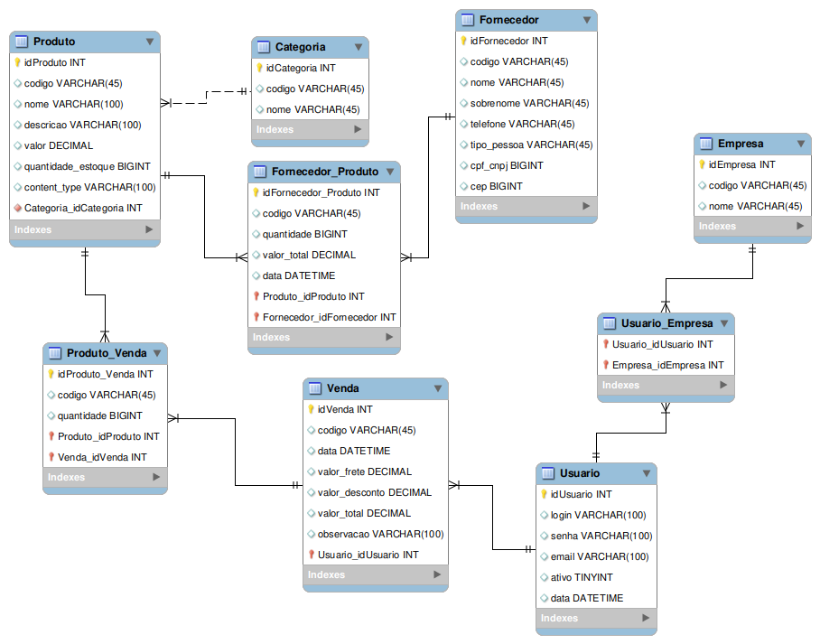

# Gestão de Estoque Inteligente

**Diogo Araújo Miranda, diogoaraujomiranda@hotmail.com**

**Danniel Henrique Correa Vieira, danniel.hcvieira@gmail.com**

**Gustavo Martins Lopes da Costa, gusluud@gmail.com**

**João Paolinelli**

---

_Curso de Ciência da Computação, Unidade {Coração Eucarístico | Praça da Liberdade}_

_Instituto de Informática e Ciências Exatas – Pontifícia Universidade de Minas Gerais (PUC MINAS), Belo Horizonte – MG – Brasil_

---

_**Resumo**. Escrever aqui o resumo. O resumo deve contextualizar rapidamente o trabalho, descrever seu objetivo e, ao final, 
mostrar algum resultado relevante do trabalho (até 10 linhas)._

---

**1. Introdução**

A introdução deve apresentar de dois ou quatro parágrafos de contextualização do trabalho. 

Na **contextualização**, o aluno deve dizer do que se trata o trabalho, em que área ou contexto se insere. 
A **contextualização** deve ser desenvolvida de algo mais genérico para algo mais específico. 
A citação de pesquisas quantitativas é bem aceita aqui (corretamente referenciadas).

Em seguida o aluno deve caminhar a contextualização para descrever o **problema** que o artigo trata. 
O **problema** pode ser algo vivido em uma empresa específica.

    1.1 Contextualização
    1.2 Problema
    1.3 Objetivo geral

O aluno deve escrever um pequeno parágrafo ou frase com o **objetivo geral** do trabalho. 
O objetivo deve ser bem direto, específico e definido com verbos de ação (elaborar, propor, ava-liar, comparar etc.).

        1.3.1 Objetivos específicos

Apresente também alguns (pelo menos 2) **objetivos específicos** depende
ndo de onde você vai querer concentrar a sua prática investigativa, ou como você vai aprofundar no seu trabalho.

    1.4 Justificativas

Mostre também as **justificativas** para o 
desenvolvimento do seu trabalho e caso deseje, desta-que alguma contribuição do trabalho.

**2. Projeto da Solução**

    2.1. Requisitos funcionais
	
A tabela a seguir representa os requisitos funcionais do projeto, em grupos de identificador, descrição e sua prioridade.

| No.           | Descrição                                 | Prioridade |
|:------------- | :---------------------------------------: | ----------:|
| RF-01         | Menu com opções de ações do usuário       | Alta       |
| RF-02         | Consultar quantidade de produto no estoque| Alta       | 
| RF-03         | Registrar produtos do estoque             | Alta       |
| RF-04         | Alertar sobre baixa quantidade de produto | Média      |
| RF-05         | Gerar gráficos dinâmicos sobre vendas     | Média      |
| RF-06         | Login para acesso ás funcionalidades      | Alta       |
| RF-07         | Cadastro de usuários                      | Alta       |
| RF-08         | Autopreenchimento nos filtros de busca    | Baixa      |
| RF-09         | Geração de relatório refêrente ao estoque | Baixa      |

    2.2. Tecnologias 

Descreva qual(is) tecnologias você vai usar para resolver o seu problema, ou seja implementar a sua solução. 
Liste todas as tecnologias envolvidas, linguagens a serem utilizadas, serviços web, frameworks, bibliotecas, 
IDEs de desenvolvimento, e ferramentas.  Apresente também uma figura explicando como as tecnologias estão 
relacionadas ou como uma interação do usuário com o sistema vai ser conduzida, por onde ela passa até 
retornar uma resposta ao usuário. 

    2.3. Serviços inteligentes

O sistema possui mecanismos de inteligência que melhoram o resultado final na utilização da aplicação. Basicamente
o mecanismo busca realizar análises estatísticas com os dados gerados pela própria aplicação e dados extraídos da 
internet, gerando relatórios essências para a tomada de decisões. O diagrama a seguir demonstra o fluxo de execução
desse sistema inteligente

**3. Metodologia**

A metodologia contempla as definições de ferramentas utilizadas pela equipe tanto
para a manutenção dos códigos e demais artefatos quanto para a organização do time na
execução das tarefas do projeto.

    3.1. Ambientes de Trabalho

Os artefatos do projeto são desenvolvidos a partir de diversas plataformas e a
relação dos ambientes com seu respectivo propósito é apresentada na tabela que se segue:

| Ambiente           | Plataforma                       | Link de Acesso |
| ------------------ |:--------------------------------:| --------------:|
| Repósitorio        | GitHub                           | https://github.com/icei-pucminas/ti2-cc-gestao-de-estoque-ti-ii |
| Documentação       | Github                           | https://github.com/icei-pucminas/ti2-cc-gestao-de-estoque-ti-ii/tree/master/documentacao |
| Wireframes         | MarvelApp                        | https://marvelapp.com/23j0g346/ |
| Gerenciamento do Projeto| Trello/GitHub Projects      | https://trello.com/b/joigfD6h/ti-2 / https://github.com/icei-pucminas/ti2-cc-gestao-de-estoque-ti-ii/projects |

    3.2. Fluxo de Publicação

Com relação à gestão do código fonte, o grupo utiliza um processo baseado no
GitHub Flow criado pelo próprio GitHub (2011), mostrado na Figura a seguir. Portanto, o
projeto segue a seguinte convenção para o nome de branchs:
- master: versão pronta para implementação (deploy).
- nome-explicativo: versão herdada da master.

Mais informações podem ser encontradas nesse [repositório](https://github.com/Warlord006/Estoque/blob/master/docs/4-Gest%C3%A3o-Configura%C3%A7%C3%A3o.md#controle-de-vers%C3%A3o) e nesse [link](https://guides.github.com/introduction/flow/).

Seguindo o modelo apresentado acima, a branch master deve estar
sempre pronta para deploy. Portanto, no momento que os pull-requests para a master são
confirmados e assinados, o projeto deve ir ao ar na plataforma escolhida para hospedagem.

    3.3. Gerenciamento do Projeto

A equipe se organiza por meio do manuseamento virtual da ferramenta Kanban
disponibilizada na plataforma Trello e no GitHub Projects. 

Utilizando o metódo Scrum combinado com o Kanban, o grupo foi organizado da seguinte forma:
- Product Owner: Diogo Araujo Miranda
- Scrum Master: João Paolinelli
- Development Team: Danniel Henrique Correa Vieira, Gustavo Martins Lopes da Costa

**4. Modelagem de dados**

Apresente o modelo de dados. Defina o dicionário de dados com os respectivos formatos e significados.

    4.1. Diagrama de Entidade-Relacionamento

Apresente a estrutura das tabelas de banco de dados no modelo Diagrama de Entidade-Relacionamento. 
A Seguir, segue um exemplo de imagem adicionada ao documento.

**5. Sistema desenvolvido**

Faça aqui uma breve descrição do software e coloque as principais telas com uma explicação de como usar cada uma.

**6. Avaliação**

Faça aqui sobre a avaliação do software. Indique se ele atendeu as expectativas e ele é viável. 
Para não ficar subjetivo, o ideal é fazer um questionário e pedir ao usuário do processo que faça a avaliação.

**7. Conclusão**

Apresente aqui a conclusão do seu trabalho. Discussão dos resultados obtidos no trabalho, onde se verifica as 
observações pessoais de cada aluno. Poderá também apresentar sugestões de novas linhas de estudo.  

**REFERÊNCIAS**

**[1.1]** - _ELMASRI, Ramez; NAVATHE, Sham. **Sistemas de banco de dados**. 7. ed. São Paulo: Pearson, c2019. E-book. ISBN 9788543025001._

**[1.2]** - _COPPIN, Ben. **Inteligência artificial**. Rio de Janeiro, RJ: LTC, c2010. E-book. ISBN 978-85-216-2936-8._

**[1.3]** - _CORMEN, Thomas H. et al. **Algoritmos: teoria e prática**. Rio de Janeiro, RJ: Elsevier, Campus, c2012. xvi, 926 p. ISBN 9788535236996._

**[1.4]** - _SUTHERLAND, Jeffrey Victor. **Scrum: a arte de fazer o dobro do trabalho na metade do tempo**. 2. ed. rev. São Paulo, SP: Leya, 2016. 236, [4] p. ISBN 9788544104514._

**[1.5]** - _RUSSELL, Stuart J.; NORVIG, Peter. **Inteligência artificial**. Rio de Janeiro: Elsevier, c2013. xxi, 988 p. ISBN 9788535237016._
