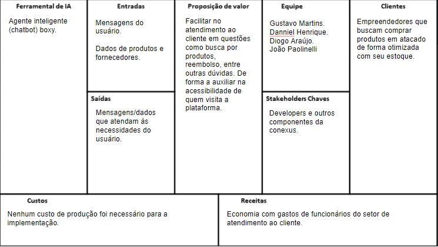
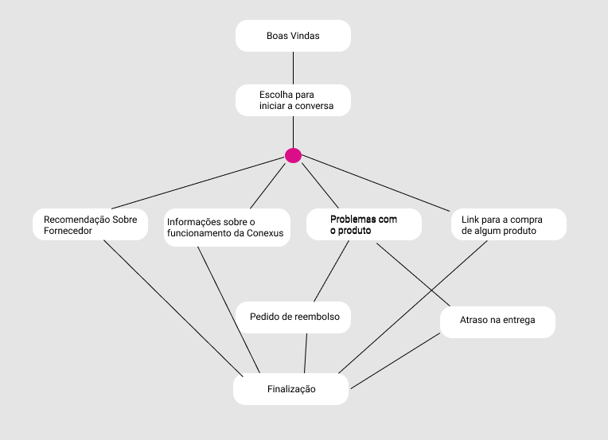

# Gestão de Fornecedores Inteligente

**Diogo Araújo Miranda, diogoaraujomiranda@hotmail.com**

**Danniel Henrique Correa Vieira, danniel.hcvieira@gmail.com**

**Gustavo Martins Lopes da Costa, gusluud@gmail.com**

**João Paolinelli e Silva, joaopaolinelli@gmail.com**

---

_Curso de Ciência da Computação, Unidade {Coração Eucarístico}_

_Instituto de Informática e Ciências Exatas – Pontifícia Universidade de Minas Gerais (PUC MINAS), Belo Horizonte – MG – Brasil_

---

_**Resumo**.  - 
	Encontrar distribuidores ou fornecedores profissionais com bons preços e que atendam os requisitos da empresa demanda tempo e dedicação sendo, em diversos casos, um processo decisivo para muitos negócios e seu respectivo sucesso. A quantidade de informação, hoje, disponibilizada online sobre fornecedores e fabricantes é de díficil acesso, necessitando um conhecimento sobre filtros de busca e dedicação para realizar, com sucesso, o contato. Em vista disso, o sistema exclusivo, hoje no Brasil, "Marketplace de bebidas alcoolicas" desenvolvido pela start-up CONEXUS SYSTEM terá um grande impacto, por proporcionar a interação entre empreendores fornecedores ou  empreendedores consumidores, em um local online de fácil acesso e visualização, cujo objetivo é facilitar pedidos, transações e analises de mercado de produtos alcoolicos.

## 1.Introdução
**1.1 Contextualização**
 - 	É importante selecionar bons fornecedores ? Sem dúvidas! O papel do fornecedor dentro de um comércio é fundamental para efetivar o abastecimento de produtos ao estoque, assim, permitindo que o fluxo de mercadorias do estabelecimento funcione de maneira continua e promissora. Entretanto, confiar em uma empresa de distribuição as cegas não é recomendado e por isso é importante definir, previamente, critérios de negóciação antes de realizar um pedido pois, infelizmente, os indices de crimes ciberneticos aumentou de forma exponêncial durante a quaretena. A falta de uma plataforma segura e confiavel é, em muitos casos, a váriavel que determina a segurança do consumidor e o sucesso da empresa, pois, a partir do momento que existe um espaço dedicado a essa necessidade, dores de cabeça banais transformamce em segurança, consequentemente, um consumidor se transforma em cliente e, facilita o trabalho do fornecedor de maneira com que, atividades banais como: negociações realizadas no telefone, se transformem em um tempo precioso dedicado a logistica dos produtos, por exemplo.
 
 	Ademais, se é necessário ter precisão ao fechar um contrato com distribuidor de um produto, em casos de varejo, o cenário pode ser ainda mais preocupante caso a rede de fornecimento não seja consistente, em diversos casos, criando situações de depedência nos consumidores sendo, eles, sujeitos ao tempo, local e boa vontade do fornecedor devido a "qualidades únicas" e complicadas de serem encontradas no mercado, cujo o final, é a frustação no cliente. Com isso, o software proposto tem o papel de ser o intermediário entre a relação fornecedor e consumidor, garantindo a eficiência ao solicitar novos produtos ou reabastecer o estoque, garantindo com que as transações realizadas sejam seguras e dentro da lei, que prazos de entrega e legitimidade sejam respeitados e, por fim, oferecendo a ambos, o conforto de negociar de maneira simplificada e moderna. 
 	
 	Desse modo, o sistema de marketplace de bebidas alcoolicas, exclusivo hoje no Brasil, é inovador por proporcionar, em um único ambiente, opções de pesquisa de produtos alcoolicos e seus respectivos preços, oferecendo a opção ao usuário, fornecedor ou consumidor, de desfrutar da confiança e facilidade oferecida no marketplace de selecionar, ou vender, seu produto da sua maneira.
   
**1.2 Problema**
 - 	Estresse, desconfiança, frustação. Esses são três sentimentos, em muitos casos, constantes no cotidiano de consumidores e fornecedores, ao estabelecer contato e realizar negociações. Inicialmente, é importante evidenciar a dificuldade, para muitos cidadões, em encontrar bons fornecedores e, realizar, respectivamente, o contato e entender o que é necessário para se tornar um parceiro. É imporante, também, verificar o historico no mercado, análisar o que outros clientes falam sobre ele e seus produtos. Com isso, é possível concluir que o trabalho para o consumidor(loja ou pessoa física), é enorme e exige dedicação e tempo.
 
	Já ao fornecedor, o trabalho pode parecer mais simples, entretanto, fazer parcerias com desconhecidos, em muitos casos, pode comprometer o nome da marca ou causar aborrecimentos com insegunranças de clientes, necessitando de um equipe SAC, filtros, ou seja, uma estrutura enorme e coêsa para proteger o nome da empresa. Nessa continuidade, existem protocolos a ser seguidos para realizar as vendas & fazer parcerias, sendo o processo burocratico e custoso, financeiramente, para ambos. 
 
	Ademais, hoje no Brasil, cresce o número de produtores artesanais de bebidas alcoolicas, seja com objetivo de realizar vendas e tornar isso seu trabalho ou até mesmo como hobby. Com isso, após a pesquisa realizada pela equipe, a maioria dos produtores artesanais, com foco em comêrcio e como atividade extra, tem interesse em ter seu produto apreciado por outras pessoas e vêm o mercado como uma oportunidade de melhorara-lo seu produto. Porém, em 90% dos casos, nas entrevistas realizadas, entrar no mercado e fazer com que o seu produto seja visto, é ainda uma dificuldade.
	
**1.3 Objetivo geral**
 - 	A start-up tem como finalidade ser a entidade que otimiza e facilita o comércio de bebidas alcoolicas, atuando como intermediario entre a relacionamento de consumidor e fornecedor. 
 	É valido destacar que, a CONEXUS SYSTEM, esta de acordo com o CDC e os termos das Marcas que desejem ser fornecedores na plataforma, assim, construindo de maneira honesta e mista, ao surgimento do primeiro marketplace de bebidas alcoolicas no Brasil, a permitir o registro de fornecedores, industriais e artesanais e consumidores finais(loja ou pessoa física). 
 	Nossa missão, é também, facilitar análises de mercado e solicições de produto, tratando o problema com seriedade, organização e respeito a nossos clientes, consumidores e fornecedores.

   - **1.3.1 Facilitar a visualização, disposição dos produtos e,respectivamente, os preços fornecidos pelas empresas **.
   
   - **1.3.2 Permitir, apartir dos dados disponibilizados, a melhor opção de compra para os cidadãos**.
   
   - **1.3.3 Mitigar discrepâncias do valor final de um produto **.

**1.4 Justificativas**

 - 	Após o desenvolvimento no 1 semestre de 2020 de um sistema de estoque, a start-up conseguiu visualizar uma oportunidade mais intuitiva e de maior impacto na socil ao reestrigir e simplificar o escopo da abordagem. Dessa forma, a CONEXUS SYSTEM, antes MPSYS, optou por trabalha de forma exclusiva com bebidas alcoolicas e não mais com o gerenciamento de estoque geral do antigo público alvo.
 	Inicialmente, para exemplificar e justificar a decisão da equipe, a start-up trabalha com a gestão de fornecedores. A palavra gestão foi mantida devido a necessidade e importância de possuir informações confiaveis e gerar resultados, assim, adicionando junto a ela, "fornecedores", a partir da decisão do grupo em seguir a oportunidade, visualizada pelos integrantes, em abordar o gerenciamento das entidades que fornecem os produtos. Foi identificado, no semestre passado, um grande mercado competitivo de gestão de estoque, sendo grande parte do tempo de trabalho da equipe anterior, dedicada a desenvolver estrategias que oferececem um diferêncial e agregace valor na vida do consumidor. Entretanto, o objetivo final exigia longas horas de trabalho e dedicação para um mercado de díficil acesso e saturado.
 	Desta forma, foi concluido que, é possível contribuir diretamente com o nosso público alvo de maneira mais efetiva. Esta ideia é ofertada, de modo que, a start-up disponibiliza informações de fornecedores e seus respectivos preços, dentro da plataforma, criando a possibilidade, dentre alguns minutos, o consumidor final(lojas ou empreendedores) fazerem seus pedidos com qualidade e até mesmo realizarem pesquisas de mercado com apenas alguns cliques. Essa abordagem, além de simplificada, é inovadora no mercado por se tratar do primeiro marketplace de bebidas alcoolicas no Brasil e não impossibilitar a gestão de estoque, se desejado, pela start-up dentro do produto da CONEXUS SYSTEM.
 	
 	Por fim, A nova solução é uma necessidade no mercado por se tratar de um processo que é de díficil mecanização tecnologica, hoje implementado pela equipe. Nossa abordagem, tem como objetivo final, atender a demanda de consumidores finais, fazendo com que seu négocio prospere e, principalmente, com que não sejam dependentes de um fornecedor, assim, favorecendo a independência dele. Ademais, a plataforma também favorece os fornecedores de grande e pequena escala, por proporcinar a venda de seus produtos de forma facilitada e em massa, por meio de estrategias de marketing como: campanhas, que serão abordadas futuramente, fomentando também, a construção da confiabiliade na marca.
 	
**2. Projeto da Solução**

    2.1. Requisitos funcionais
	
A tabela a seguir representa os requisitos funcionais do projeto, em grupos de identificador, descrição e sua prioridade.

| No.           | Descrição                                 | Prioridade |
|:------------- | :---------------------------------------: | ----------:|
| RF-01         | Consultar os bebidas disponíveis          | Alta       |
| RF-02         | Listar os bebidas e forncedores           | Alta       | 
| RF-03         | Criar licitações de bebidas               | Alta       |
| RF-04         | Login e cadastro compradores              | Média      |
| RF-05         | Chat bot para consultas e pedidos         | Média      |
| RF-06         | Login e cadastro de fornecedores          | Baixa      |
| RF-07         | Cadastro de bebidas por fornecedores      | Baixa      |

    2.2. Tecnologias Chat bot para consultas e pedidos 

O desenvolvimento da aplicação é baseado no modelo MVC (Model-View-Controller) em que seus servições serão disponilizados
via aplicação web (website), e seu diagrama de tecnologias é representado a seguir: 

- (VIEW) As tecnologias básicas de desenvolvimento web - HTML, CSS, JS - serão utilizadas para tornar os dados visíveis aos usuários finais.
- (CONTROLLER) A parte de controle da aplicação é feita em Java, com auxilio das tecnologias Spark Framework e Maven integrada, e como ambiente
de trabalho foi utilizado a IDE Eclipse.
- (MODEL) O modelo da aplicação é feita no banco de dados relacional PostgreSQL

    2.3. Serviços inteligentes
    
A proposta da integração de um sistema inteligente no software é inovadora e de alto potêncial, por meio da plataforma Blip. De maneira simples, as tecnologias implementadas no projeto CONEXUS SYSTEM, tem como objetivo realizar pesquisas dentro do proprio banco de dados de fornecedores & produtos para transformar a demanda do usuário em uma simples tarefa. Dessa maneira, apartir da utilização da tecnologia de inteligência artificial programada para atuar a partir da interação e conhecimento do desejo do usuário, é possível gerar resultados imediatos apartir de necessidades evidênciadas durante uma simples conversa ou exigência direta. Por fim, a equipe também se interessa por captar e filtrar informações de outras plataformas de venda para inclusão no banco de dados por meio de serviços inteligentes

### is canvas ###

### Fluxo do usuário ###

 - Link para testes e experimentações do chatbot: https://chat.blip.ai/?appKey=Ym94eTE6ODkxMDE0NzctMjdmNC00MDk5LWE2MjYtYzQ4ZWM0OThhYjQ1 

**3. Metodologia**

A metodologia contempla as definições de ferramentas utilizadas pela equipe tanto
para a manutenção dos códigos e demais artefatos quanto para a organização do time na
execução das tarefas do projeto.

    3.1. Ambientes de Trabalho

Os artefatos do projeto são desenvolvidos a partir de diversas plataformas e a
relação dos ambientes com seu respectivo propósito é apresentada na tabela que se segue:

| Ambiente           | Plataforma                       | Link de Acesso |
| ------------------ |:--------------------------------:| --------------:|
| Repósitorio        | GitHub                           | https://github.com/icei-pucminas/ti2-cc-gestao-de-estoque-ti-ii |
| Documentação       | Github                           | https://github.com/icei-pucminas/ti2-cc-gestao-de-estoque-ti-ii/tree/master/documentacao |
| Wireframes         | MarvelApp                        | https://marvelapp.com/23j0g346/ |
| Gerenciamento do Projeto| Trello/GitHub Projects      | https://trello.com/b/joigfD6h/ti-2 / https://github.com/icei-pucminas/ti2-cc-gestao-de-estoque-ti-ii/projects |

    3.2. Fluxo de Publicação

Com relação à gestão do código fonte, o grupo utiliza um processo baseado no
GitHub Flow criado pelo próprio GitHub (2011), mostrado na Figura a seguir. Portanto, o
projeto segue a seguinte convenção para o nome de branchs:
- master: versão pronta para implementação (deploy).
- nome-explicativo: versão herdada da master.

Mais informações podem ser encontradas nesse [repositório](https://github.com/Warlord006/Estoque/blob/master/docs/4-Gest%C3%A3o-Configura%C3%A7%C3%A3o.md#controle-de-vers%C3%A3o) e nesse [link](https://guides.github.com/introduction/flow/).

Seguindo o modelo apresentado acima, a branch master deve estar
sempre pronta para deploy. Portanto, no momento que os pull-requests para a master são
confirmados e assinados, o projeto deve ir ao ar na plataforma escolhida para hospedagem.

    3.3. Gerenciamento do Projeto

A equipe se organiza por meio do manuseamento virtual da ferramenta Kanban
disponibilizada na plataforma Trello e no GitHub Projects. 

Utilizando o metódo Scrum combinado com o Kanban, o grupo foi organizado da seguinte forma:
- Product Owner: Diogo Araujo Miranda
- Scrum Master: João Paolinelli
- Development Team: Danniel Henrique Correa Vieira, Gustavo Martins Lopes da Costa

**4. Modelagem de dados**

A estrutura do banco de dados basea-se basicamente em dados relacionais, em que sua abstração leva 
em conta os requisitos e as histórias de usuário apresentadas nesse artigo. Abaixo é representado
o diagrama de entidade-relacionamento do sistema, que explica a relação entre os dados e suas abstrações.

    4.1. Diagrama de Entidade-Relacionamento

**5. Sistema desenvolvido**

O sistema desenvolvido basea-se em uma versão resumida dos dados disponíveis nesse documento, sendo possível encontra-la nas atas desse respositório. Basicamente cumpre os requisitos de realização de pedidos a partir de um site, em que um usuário é capaz de realizar pedidos e também cadastrar bebidas para ficarem disponíveis ao sistema de estoque.

**6. Avaliação**

O software é intuitivo. A interação com o menu lateral torna possível visualizar o objetivo do empreendimento e obter resultados imediatos, sendo a expectiva da proposta e conclusão do trabalho uma ferramenta de alto nível que promete atender nosso público-alvo. A interação entre a pagina web e nosso banco de dados ainda está sendo trabalhada, ademais, servidor, estrutura e preparação para integração com o sistema inteligente já está sendo trabalhada.

**7. Conclusão**

Com o uso das tecnologias utilizadas, a última versão do projeto foi divulgada em http://conexussystem.herokuapp.com/, em que cumpriu os requisitos do sistema. Esta versão do projeto possui uma estrutura de banco de dados simplificada disponível nas atas, mas que segue a estrutura do DER diponível nesse conteúdo. O acesso ao site é possível a partir de um cadastro de um usuário - que será tanto fornecedor quanto comprador - e realização de pedidos encima do estoque disponível. Por fim, o assistente virtual auxilia com a navegação pelo site e com as funcionalidades disponíveis.

**8. Perspectivas Futuras**

As perspectivas futuras consistem em uma sofisticação do script de banco usado nessa versão do projeto atual, colocando a questão de seperação de fornecedores de compradores - restringindo as views - juntamente com a implementação de uma sessão de usuários separadas para cada um. Também o implementação de fornecedores por cidade escolhida, como previsto no modelo de dados. Também a implementação do sistema inteligente para analisar os melhores produtos dos melhores fornecedores disponíveis na internet, previsto nesse documento.

**REFERÊNCIAS**

**[1.1]** - _ELMASRI, Ramez; NAVATHE, Sham. **Sistemas de banco de dados**. 7. ed. São Paulo: Pearson, c2019. E-book. ISBN 9788543025001._

**[1.2]** - _COPPIN, Ben. **Inteligência artificial**. Rio de Janeiro, RJ: LTC, c2010. E-book. ISBN 978-85-216-2936-8._

**[1.3]** - _CORMEN, Thomas H. et al. **Algoritmos: teoria e prática**. Rio de Janeiro, RJ: Elsevier, Campus, c2012. xvi, 926 p. ISBN 9788535236996._

**[1.4]** - _SUTHERLAND, Jeffrey Victor. **Scrum: a arte de fazer o dobro do trabalho na metade do tempo**. 2. ed. rev. São Paulo, SP: Leya, 2016. 236, [4] p. ISBN 9788544104514._

**[1.5]** - _RUSSELL, Stuart J.; NORVIG, Peter. **Inteligência artificial**. Rio de Janeiro: Elsevier, c2013. xxi, 988 p. ISBN 9788535237016._
