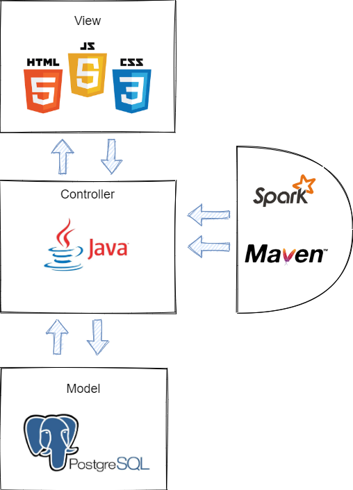
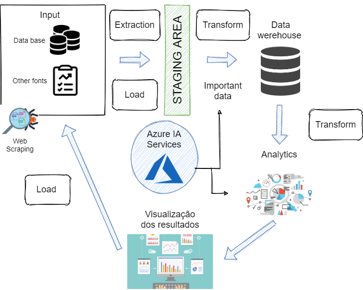
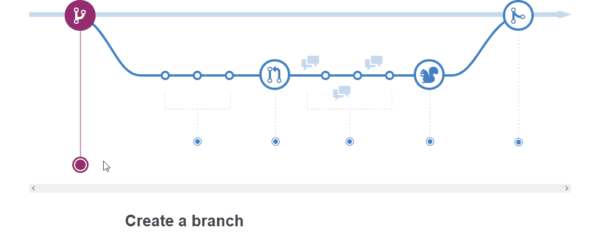
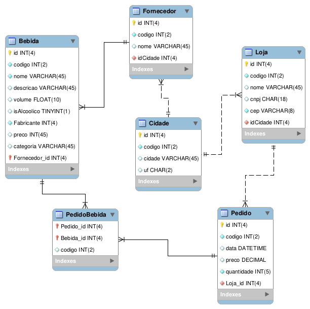

# Gestão de Fornecedores Inteligente

**Diogo Araújo Miranda, diogoaraujomiranda@hotmail.com**

**Danniel Henrique Correa Vieira, danniel.hcvieira@gmail.com**

**Gustavo Martins Lopes da Costa, gusluud@gmail.com**

**João Paolinelli e Silva, joaopaolinelli@gmail.com**

---

_Curso de Ciência da Computação, Unidade {Coração Eucarístico}_

_Instituto de Informática e Ciências Exatas – Pontifícia Universidade de Minas Gerais (PUC MINAS), Belo Horizonte – MG – Brasil_

---

_**Resumo**.  - Encontrar distribuidores profissionais com bons preços e que atendam os requisitos da empresa demanda tempo e, em diversos casos, pode retardar o progresso de muitos negócios. A quantidade de informação, hoje, disponibilizada online sobre fornecedores e fabricantes não é suficient para fazer o melhor pedido ou comparação de preços. Em vista disso, o produto em desenvolvimento pela start-up CONEXUS SYSTEM terá um grande impacto, proporcionando a milhões de empreendores um produto de fácil acesso, interpretação, comparação e compra efetiva.

## 1.Introdução
**1.1 Contextualização**
 - É importante selecionar fornecedores ? Sem dúvidas! O papel do fornecedor dentro de uma empresa é fundamental para efetivar o abastecimento de seus produtos e fazer com o estabelecimento funcione de maneira continua em um ponto de venda determinado. Entretanto, confiar em uma empresa de distribuição as cegas não é recomendado e por isso é importante definir os critérios de negócio previamente antes de fazer um pedido. A falta desse conhecimento, é, em muitos casos, a váriavel que determina o sucesso de seu negócio, pois, a reposição de estoque é diretamente relacionado ao número de vendas.
  Ademais, se é necessário ter precisão ao fechar um contrato com distribuidor de um produto, em casos de varejo, o cenário pode ficar ainda mais comprometido caso a rede de fornecimento não seja sólida. Com isso, o software proposto é o intermediário entre esse contato, garantindo eficiência ao solicitar o reabastecimento do estoque e inovador por proporcionar um ambiente único de pesquisa de diversos produtos que estão relacionados a varias empresas, cabendo ao usuário análiser e efetivar o pedido apartir das melhores condições em seu cenário.
  
   
**1.2 Problema**
 - O sucesso financeiro de uma empresa ou empreendedor possui uma forte relação com a entidade que fornece os suprimentos necessários para atender a demanda dos consumidores da empresa. Isso significa, em alguns casos, a existência de negócios que dependam 100% de somente um fornecedor ou um grupo deles, havendo a necessidade de aceitar imposições de mercado por insegurança financeira ou falta do conhecimento necessário para selecionar outras companias para manufaturar seus produtos, seja por falta de uma lista atualizada de fornecedores ou falta de experiência em negociações de alta escala.
 
**1.3 Objetivo geral**
 - A start-up tem como finalidade ser o divisor de águas para muitos cidadãos quando a necessidade é procurar por fornecedores, altas quantidades de produtos e principalmente, um bom preço! Por meio de uma plataforma web e futuramente um aplicativo movel, é possível comparar o valor do mesmo tipo de mercadoria oferecido por diversas empresas ou comércios, diminuindo o tempo de navegação e esforço do usuário ao visitar sites ou contatar comerciantes desconhecidos e estar sujeito a sua exigência. Na plataforma CONEXUS SYSTEM, o usuário só realiza um pedido caso ele seja correspondente a sua premissa. 

   - **1.3.1 Facilitar a visualização, disposição dos produtos e,respectivamente, os preços fornecidos pelas empresas **.
   
   - **1.3.2 Permitir, apartir dos dados disponibilizados, a melhor opção de compra para os cidadãos**.
   
   - **1.3.3 Mitigar discrepâncias do valor final de um produto **.

**1.4 Justificativas**
 - Após o desenvolvimento no 1 semestre de 2020 de um sistema de estoque, a start-up conseguiu visualizar uma oportunidade mais intuitiva e de maior impacto na vida dos empreendedores por meio do software que realiza a gestão de fornecedores & de produtos. Com isso, o desperdicio notado no cotidiano dos comerciantes continua um grande problema que atinge diversas empresas e, consequentemente, possuindo uma relação direta com prejuizo financeiro, fechamento de portas ou ausência de lucro. Entretanto, ao analisar a situação, é possível compreender que o lucro e prejuizo estão, também, relacionados a quantia financeira paga pela manufatura do produto, em muitos casos, sendo ela o diferencial na vida de muitos cidadãos ao se adequar a competitividade e gerar um diferêncial no mercado. Assim, fazendo com que problemas relacionados a poucos clientes e quantias um pouco acima do essencial para a venda em um determinado tempo, torne-se uma maneira de lucrar e fornecer, em diversos casos, lojas "vizinhas" que não demandam de um alto estoque e possuem ocasionalmente necessedidade de produtos, consequentemente, resolvendo o problema inicial e proporcionando um método de empreendimento intuitivo de alta escalabilidade, além da opção facilitada de seleção de fornecedores.

**2. Projeto da Solução**

    2.1. Requisitos funcionais
	
A tabela a seguir representa os requisitos funcionais do projeto, em grupos de identificador, descrição e sua prioridade.

| No.           | Descrição                                 | Prioridade |
|:------------- | :---------------------------------------: | ----------:|
| RF-01         | Consultar os bebidas disponíveis          | Alta       |
| RF-02         | Listar os bebidas e forncedores           | Alta       | 
| RF-03         | Criar licitações de bebidas               | Alta       |
| RF-04         | Login e cadastro compradores              | Média      |
| RF-05         | Chat bot para consultas e pedidos         | Média      |
| RF-06         | Login e cadastro de fornecedores          | Baixa      |
| RF-07         | Cadastro de bebidas por fornecedores      | Baixa      |

    2.2. Tecnologias Chat bot para consultas e pedidos 

O desenvolvimento da aplicação é baseado no modelo MVC (Model-View-Controller) em que seus servições serão disponilizados
via aplicação web (website), e seu diagrama de tecnologias é representado a seguir: 

- (VIEW) As tecnologias básicas de desenvolvimento web - HTML, CSS, JS - serão utilizadas para tornar os dados visíveis aos usuários finais.
- (CONTROLLER) A parte de controle da aplicação é feita em Java, com auxilio das tecnologias Spark Framework e Maven integrada, e como ambiente
de trabalho foi utilizado a IDE Eclipse.
- (MODEL) O modelo da aplicação é feita no banco de dados relacional PostgreSQL

    2.3. Serviços inteligentes
    
A proposta da integração de um sistema inteligente no software é inovadora e de alto potêncial. De maneira simples, as tecnologias que futuramente serão implementadas no projeto CONEXUS SYSTEM, tem como objetivo realizar pesquisas dentro do proprio banco de dados de fornecedores & produtos para transformar a demanda do usuário em uma simples tarefa. Dessa maneira, apartir da utilização da tecnologia de inteligência artificial programada para atuar a partir da interação e conhecimento do desejo do usuário, será possível gerar resultados imediatos apartir de necessidades evidênciadas durante uma simples conversa ou exigência direta. Por fim, a equipe também se interessa por captar e filtrar informações de outras plataformas de venda para inclusão no banco de dados por meio de serviços inteligentes.

**3. Metodologia**

A metodologia contempla as definições de ferramentas utilizadas pela equipe tanto
para a manutenção dos códigos e demais artefatos quanto para a organização do time na
execução das tarefas do projeto.

    3.1. Ambientes de Trabalho

Os artefatos do projeto são desenvolvidos a partir de diversas plataformas e a
relação dos ambientes com seu respectivo propósito é apresentada na tabela que se segue:

| Ambiente           | Plataforma                       | Link de Acesso |
| ------------------ |:--------------------------------:| --------------:|
| Repósitorio        | GitHub                           | https://github.com/icei-pucminas/ti2-cc-gestao-de-estoque-ti-ii |
| Documentação       | Github                           | https://github.com/icei-pucminas/ti2-cc-gestao-de-estoque-ti-ii/tree/master/documentacao |
| Wireframes         | MarvelApp                        | https://marvelapp.com/23j0g346/ |
| Gerenciamento do Projeto| Trello/GitHub Projects      | https://trello.com/b/joigfD6h/ti-2 / https://github.com/icei-pucminas/ti2-cc-gestao-de-estoque-ti-ii/projects |

    3.2. Fluxo de Publicação

Com relação à gestão do código fonte, o grupo utiliza um processo baseado no
GitHub Flow criado pelo próprio GitHub (2011), mostrado na Figura a seguir. Portanto, o
projeto segue a seguinte convenção para o nome de branchs:
- master: versão pronta para implementação (deploy).
- nome-explicativo: versão herdada da master.

Mais informações podem ser encontradas nesse [repositório](https://github.com/Warlord006/Estoque/blob/master/docs/4-Gest%C3%A3o-Configura%C3%A7%C3%A3o.md#controle-de-vers%C3%A3o) e nesse [link](https://guides.github.com/introduction/flow/).

Seguindo o modelo apresentado acima, a branch master deve estar
sempre pronta para deploy. Portanto, no momento que os pull-requests para a master são
confirmados e assinados, o projeto deve ir ao ar na plataforma escolhida para hospedagem.

    3.3. Gerenciamento do Projeto

A equipe se organiza por meio do manuseamento virtual da ferramenta Kanban
disponibilizada na plataforma Trello e no GitHub Projects. 

Utilizando o metódo Scrum combinado com o Kanban, o grupo foi organizado da seguinte forma:
- Product Owner: Diogo Araujo Miranda
- Scrum Master: João Paolinelli
- Development Team: Danniel Henrique Correa Vieira, Gustavo Martins Lopes da Costa

**4. Modelagem de dados**

A estrutura do banco de dados basea-se basicamente em dados relacionais, em que sua abstração leva 
em conta os requisitos e as histórias de usuário apresentadas nesse artigo. Abaixo é representado
o diagrama de entidade-relacionamento do sistema, que explica a relação entre os dados e suas abstrações.

    4.1. Diagrama de Entidade-Relacionamento

**5. Sistema desenvolvido**

O sistema se encontra em estado de teste, sendo trabalhado no momento, o aperfeiçoamento de interações CRUD. Com objetivo de obter 100% do funcionamento das ferramentas utilizadas, foi adotado pela equipe uma interface estatica para facilitar as interacoes e consultas efetivadas. Na pagina, 162.214.151.86/~ti2/ , o sistema se divide, no momento em 3 fases, contendo um header, um painel lateral esquerdo e uma tela de reproducao dos elementos, centralizada no meio/canto direito.
As seguintes opcoes estao disponiveis, "Registrar" & "Fornecedor", porem ainda nao estao sincronizadas com o atual banco de dados.

**6. Avaliação**

O software é intuitivo. A interação com o menu lateral torna possível visualizar o objetivo do empreendimento e obter resultados imediatos, sendo a expectiva da proposta e conclusão do trabalho uma ferramenta de alto nível que promete atender nosso público-alvo. A interação entre a pagina web e nosso banco de dados ainda está sendo trabalhada, ademais, servidor, estrutura e preparação para integração com o sistema inteligente já está sendo trabalhada.

**7. Conclusão**

Com o uso das tecnologias utilizadas, a última versão do projeto foi divulgada em http://conexussystem.herokuapp.com/, em que cumpriu os requisitos do sistema. Esta versão do projeto possui uma estrutura de banco de dados simplificada disponível nas atas, mas que segue a estrutura do DER diponível nesse conteúdo. O acesso ao site é possível a partir de um cadastro de um usuário - que será tanto fornecedor quanto comprador - e realização de pedidos encima do estoque disponível. Por fim, o assistente virtual auxilia com a navegação pelo site e com as funcionalidades disponíveis.

**8. Percspectivas Futuras**

As perspectivas futuras consistem em uma sofitsticação do script de banco usado nessa versão do projeto atual, colocando a questão de seperação de fornecedores de compradores - restringindo as views - juntamente com a implementação de uma sessão de usuários separadas para cada um. Também o implementação de fornecedores por cidade escolhida, como previsto no modelo de dados. Também a implementação do sistema inteligente para analisar os melhores produtos dos melhores fornecedores disponíveis na internet, previsto nesse documento.

**REFERÊNCIAS**

**[1.1]** - _ELMASRI, Ramez; NAVATHE, Sham. **Sistemas de banco de dados**. 7. ed. São Paulo: Pearson, c2019. E-book. ISBN 9788543025001._

**[1.2]** - _COPPIN, Ben. **Inteligência artificial**. Rio de Janeiro, RJ: LTC, c2010. E-book. ISBN 978-85-216-2936-8._

**[1.3]** - _CORMEN, Thomas H. et al. **Algoritmos: teoria e prática**. Rio de Janeiro, RJ: Elsevier, Campus, c2012. xvi, 926 p. ISBN 9788535236996._

**[1.4]** - _SUTHERLAND, Jeffrey Victor. **Scrum: a arte de fazer o dobro do trabalho na metade do tempo**. 2. ed. rev. São Paulo, SP: Leya, 2016. 236, [4] p. ISBN 9788544104514._

**[1.5]** - _RUSSELL, Stuart J.; NORVIG, Peter. **Inteligência artificial**. Rio de Janeiro: Elsevier, c2013. xxi, 988 p. ISBN 9788535237016._
